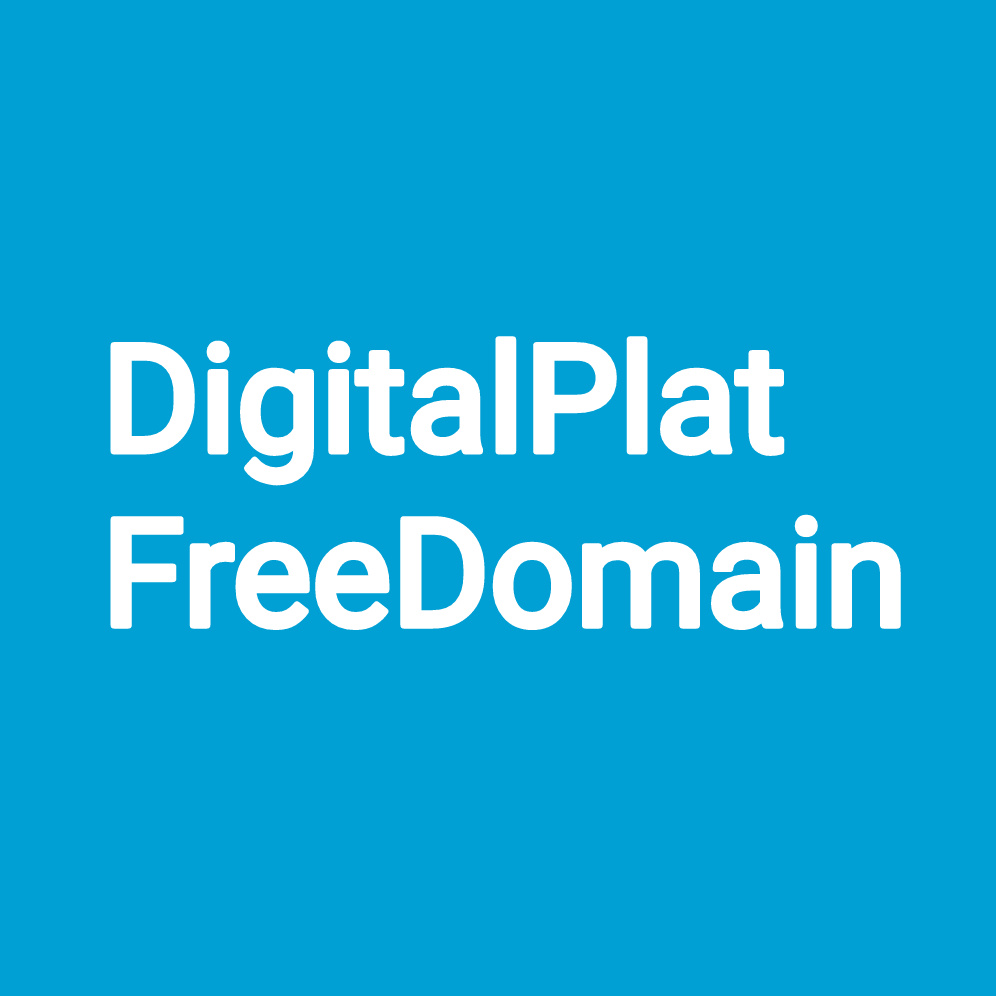

## 🌐 Welcome to DigitalPlat Domain

  

Welcome to **DigitalPlat FreeDomain**, where we believe everyone deserves a digital identity. Whether you're an individual, or an organization, we’re offering free domain names to bring your ideas to life – no strings attached!

With FreeDomain, you’re free to register a unique domain and host it with your favorite DNS provider, like Cloudflare, FreeDNS by Afraid.org, or Hostry. Get online with complete freedom, and keep your wallet happy.

### ✔️ Why Free Domains?

At **DigitalPlat FreeDomain**, we’re on a mission to make the web more accessible. We believe that the cost of a domain shouldn’t hold anyone back from creating a website. Our goal is to make the internet an open space where everyone can have their own place online, regardless of budget.

> DigitalPlat FreeDomain is independently designed and maintained by [**Edward Hsing**](https://github.com/EdwardLab), founder of the DigitalPlat Foundation.

---

### 🌍 Available Domain Extensions

- **.DPDNS.ORG**
- **.US.KG**
- **.QZZ.IO**
- **.XX.KG**
- **.QD.JE**

_(More extensions coming soon!)_

---

### 🌍 Ready to Claim Your Free Domain?

Jump in and register your domain by visiting our site:

➡️ [DigitalPlat FreeDomain Dashboard](https://dash.domain.digitalplat.org/)

📝 [Read our tutorial](./documents/tutorial/index.md)

---

### 🌟 Trusted by Thousands

With over 500,000 domains already registered, DigitalPlat FreeDomain is a trusted choice for individuals and organizations alike. Join our growing community and claim your own free domain today!

---

### ❔ FAQ

Check [FAQ Page](./documents/domains/faq.md)

---

### 🤝 Join Our Community!

🆕 Join the official [DigitalPlat FreeDomain Telegram group](https://t.me/digitalplatdomain), [Discord server](https://discord.gg/ma4RZzMmVW) today! Be the first to know about the latest updates and happenings! Got questions? Facing challenges? Or simply want to show off your awesome builds? Don’t wait—become part of our community now! 🚀

---

### ⏭️ What's next
We might introduce more domain options and free hosting in the future to help as many people as possible! 

**We can’t wait to see what you build!**

---

### 🚨 Abuse Reporting
We take domain name abuse seriously and are committed to maintaining a safer and more open internet. Every report is carefully reviewed, and response times may vary from a few hours to several days, depending on the complexity of the case.

Email: abusereport@digitalplat.org

---

## 🧠 Story

This started as a small DNS experiment when I was 15, letting a few friends use subdomains.

Over time, it grew into something people actually rely on, and running it turned out to be much harder than building it.

I wrote a bit about how it evolved here:  
https://dev.to/edwardhsing/i-bought-a-domain-at-15-now-it-powers-400000-users-7ol

---

## 🚀 Modern Documentation Revamp
This project documentation has been enhanced to meet modern standards.

### ✨ Highlights
- **Automated Insights**: Real-time repository metadata.
- **Improved Scannability**: Better use of hierarchy and formatting.
- **Contribution Support**: Clearer paths for community involvement.

### 📊 Repository Vitals

| Metric | Status |
| :--- | :--- |
| Build Status |  |
| Documentation |  |
| Activity |  |

## 🛠 Project Enhancements

  
  
  

### 🚀 Recent Updates
- [x] Standardized documentation structure
- [x] Added dynamic repository badges
- [ ] Implement automated testing suite (Roadmap)

<b>🔍 View Repository Metadata (Click to expand)</b>

## 🚀 Project Overview
This repository documentation has been enhanced to improve clarity and structure.

## ✨ Features
- Improved documentation structure
- Repository metadata and badges
- Automated activity insights
- Contribution guidance

## 📊 Repository Statistics

## 🕒 Last Updated
Sat Apr 11 18:14:59 AST 2026

---
### 🤖 Automated Documentation Update
Generated by automation to enhance repository quality.
