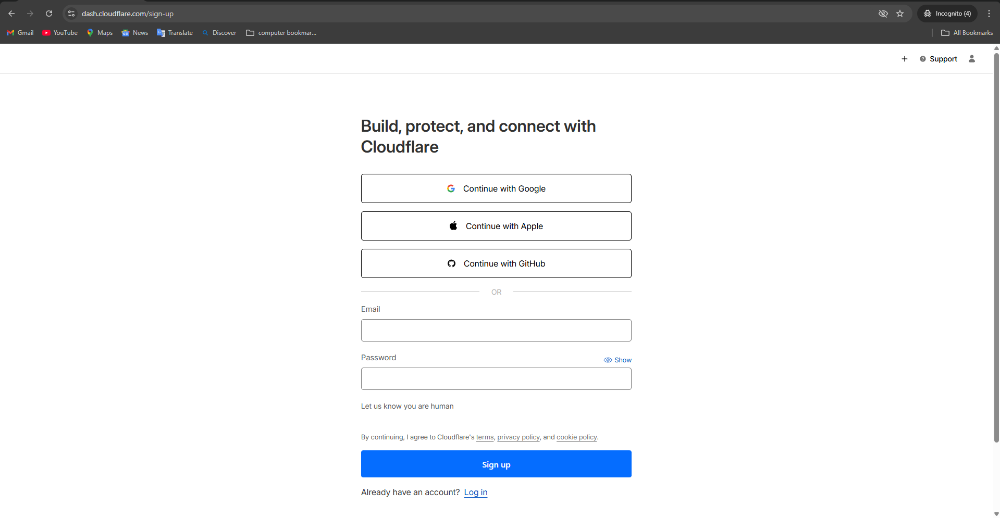
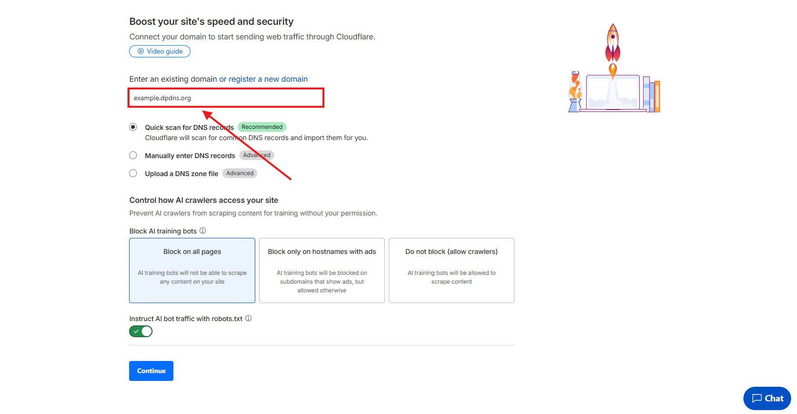
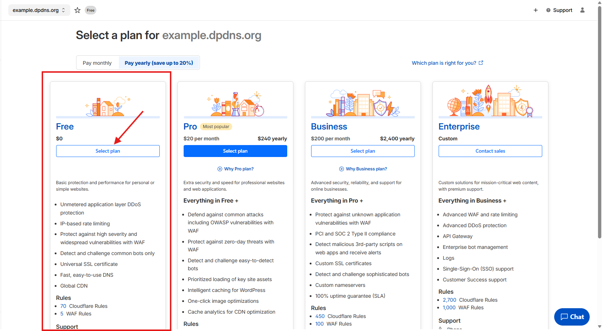
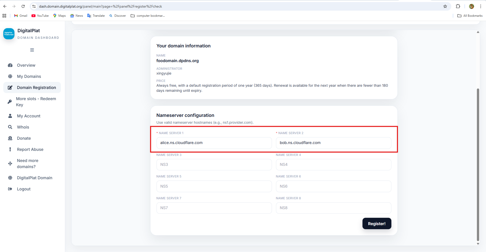
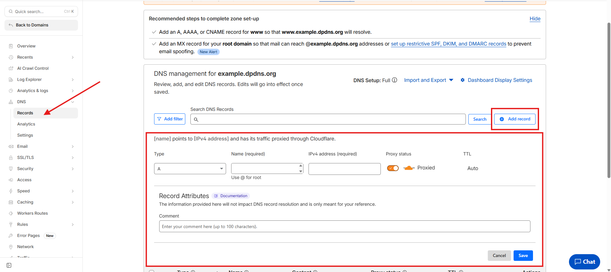

# DNS Hosting

After registering your DigitalPlat account, the next step is choosing a DNS hosting provider.

DigitalPlat works with **any standard DNS provider**, but for beginners, we strongly recommend **Cloudflare**. It’s free, reliable, fast, and easy to use.

This guide walks you through setting up DNS hosting with Cloudflare.

## Why Cloudflare?

Cloudflare is a popular DNS and security platform trusted by millions of websites worldwide.

It’s a good choice because:

- Free plan is enough for most users
- Clean and beginner-friendly interface
- Fast global DNS network
- No hidden limits for basic DNS usage

You can always switch to another provider later.

## Step 1: Create a Cloudflare Account

Go to Cloudflare and create an account:

👉 https://dash.cloudflare.com/sign-up



Use a real email address. You’ll need it to manage your DNS later.

## Step 2: Add Your Domain to Cloudflare

After logging in, click **Add a site** and enter your domain name.

Example:

```
example.dpdns.org
```



Select the **Free** plan when asked.



Cloudflare will automatically scan existing DNS records.
 If your domain is new, this list may be empty. That’s fine.

Continue to the next step.

## Step 3: Update Nameservers

Cloudflare will assign two nameservers to your domain, for example:

```
alice.ns.cloudflare.com
bob.ns.cloudflare.com
```

Go back to the **DigitalPlat dashboard**, open your domain settings, and replace the current nameservers with the Cloudflare ones.




Save the changes.

DNS propagation usually takes a few minutes, but in some cases it may take up to 24 hours.

## Step 4: Verify DNS Is Active

Once the nameservers are updated, Cloudflare will automatically detect the change.

You’ll see your domain status become **Active** in the Cloudflare dashboard.

At this point, Cloudflare is successfully hosting your DNS.

## Step 5: Manage DNS Records

In Cloudflare, open your domain and go to **DNS → Records**.



Here you can add records such as:

- **A / AAAA** for pointing to an IP address
- **CNAME** for linking to another domain
- **TXT** for verification or services

Changes usually take effect within seconds.

## Alternative DNS Providers

Cloudflare is recommended, but not required.

If you already use another DNS provider, DigitalPlat also works with:

- FreeDNS
- Hostry
- Any provider that supports custom nameservers

Advanced users can even run their own DNS servers.

## Next Step

Now that DNS hosting is set up, you’re ready to connect your domain and start using it with services.

Continue to the next guide to configure domain records and activation.